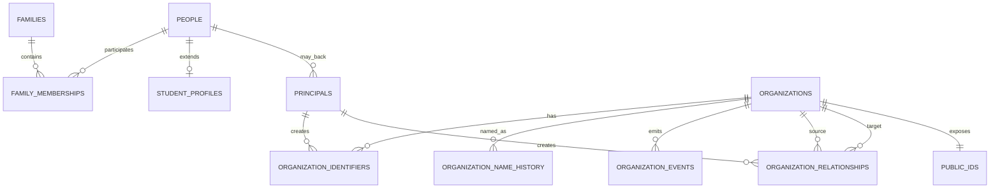

# M0 ERD

```mermaid
erDiagram
  PEOPLE ||--o{ FAMILY_MEMBERSHIPS : participates
  FAMILIES ||--o{ FAMILY_MEMBERSHIPS : contains
  PEOPLE ||--o| STUDENT_PROFILES : extends
  PEOPLE ||--o{ PRINCIPALS : may_back
  ORGANIZATIONS ||--o{ ORGANIZATION_IDENTIFIERS : has
  ORGANIZATIONS ||--o{ ORGANIZATION_NAME_HISTORY : named_as
  ORGANIZATIONS ||--o{ ORGANIZATION_EVENTS : emits
  ORGANIZATIONS ||--o{ ORGANIZATION_RELATIONSHIPS : source
  ORGANIZATIONS ||--o{ ORGANIZATION_RELATIONSHIPS : target
  ORGANIZATIONS ||--|| PUBLIC_IDS : exposes
  PRINCIPALS ||--o{ ORGANIZATION_IDENTIFIERS : creates
  PRINCIPALS ||--o{ ORGANIZATION_RELATIONSHIPS : creates
```

All relationship arrows point to existing Canonical authorities. No duplicate Person, Family, Student or Principal entity is introduced.
