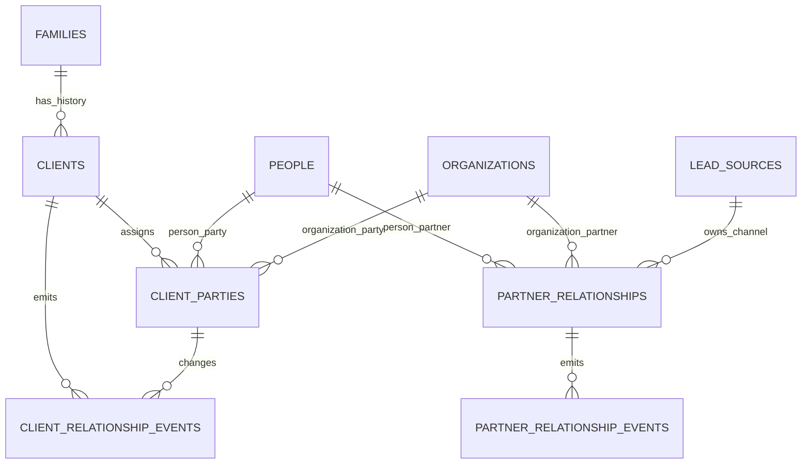

# M1 ERD

```mermaid
erDiagram
  FAMILIES ||--o{ CLIENTS : has_history
  CLIENTS ||--o{ CLIENT_PARTIES : assigns
  PEOPLE ||--o{ CLIENT_PARTIES : person_party
  ORGANIZATIONS ||--o{ CLIENT_PARTIES : organization_party
  CLIENTS ||--o{ CLIENT_RELATIONSHIP_EVENTS : emits
  CLIENT_PARTIES ||--o{ CLIENT_RELATIONSHIP_EVENTS : changes
  PEOPLE ||--o{ PARTNER_RELATIONSHIPS : person_partner
  ORGANIZATIONS ||--o{ PARTNER_RELATIONSHIPS : organization_partner
  LEAD_SOURCES ||--o{ PARTNER_RELATIONSHIPS : owns_channel
  PARTNER_RELATIONSHIPS ||--o{ PARTNER_RELATIONSHIP_EVENTS : emits
```
