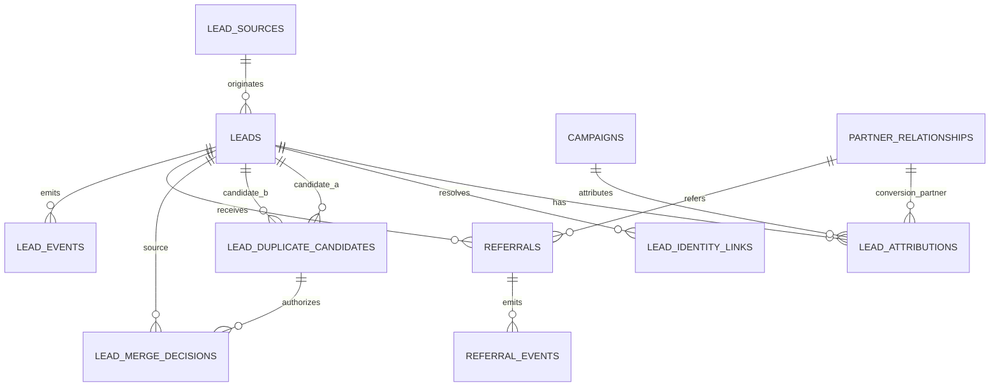

# M2 ERD

```mermaid
erDiagram
  LEAD_SOURCES ||--o{ LEADS : originates
  LEADS ||--o{ LEAD_ATTRIBUTIONS : has
  CAMPAIGNS ||--o{ LEAD_ATTRIBUTIONS : attributes
  PARTNER_RELATIONSHIPS ||--o{ LEAD_ATTRIBUTIONS : conversion_partner
  LEADS ||--o{ LEAD_IDENTITY_LINKS : resolves
  LEADS ||--o{ LEAD_DUPLICATE_CANDIDATES : candidate_a
  LEADS ||--o{ LEAD_DUPLICATE_CANDIDATES : candidate_b
  LEAD_DUPLICATE_CANDIDATES ||--o{ LEAD_MERGE_DECISIONS : authorizes
  LEADS ||--o{ LEAD_MERGE_DECISIONS : source
  LEADS ||--o{ REFERRALS : receives
  PARTNER_RELATIONSHIPS ||--o{ REFERRALS : refers
  REFERRALS ||--o{ REFERRAL_EVENTS : emits
  LEADS ||--o{ LEAD_EVENTS : emits
```
