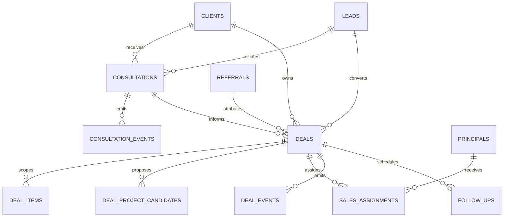

# M3 ERD

```mermaid
erDiagram
  LEADS ||--o{ CONSULTATIONS : initiates
  CLIENTS ||--o{ CONSULTATIONS : receives
  CONSULTATIONS ||--o{ CONSULTATION_EVENTS : emits
  CLIENTS ||--o{ DEALS : owns
  LEADS ||--o{ DEALS : converts
  REFERRALS ||--o{ DEALS : attributes
  CONSULTATIONS ||--o{ DEALS : informs
  DEALS ||--o{ DEAL_ITEMS : scopes
  DEALS ||--o{ DEAL_PROJECT_CANDIDATES : proposes
  DEALS ||--o{ SALES_ASSIGNMENTS : assigns
  DEALS ||--o{ DEAL_EVENTS : emits
  DEALS ||--o{ FOLLOW_UPS : schedules
  PRINCIPALS ||--o{ SALES_ASSIGNMENTS : receives
```
