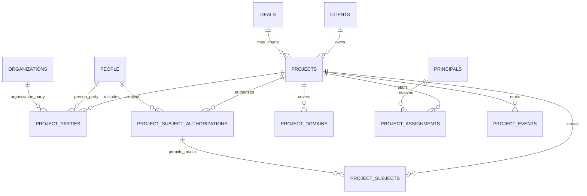

# M4 ERD

```mermaid
erDiagram
  CLIENTS ||--o{ PROJECTS : owns
  DEALS ||--o{ PROJECTS : may_create
  PROJECTS ||--o{ PROJECT_PARTIES : includes
  PEOPLE ||--o{ PROJECT_PARTIES : person_party
  ORGANIZATIONS ||--o{ PROJECT_PARTIES : organization_party
  PROJECTS ||--o{ PROJECT_SUBJECT_AUTHORIZATIONS : authorizes
  PEOPLE ||--o{ PROJECT_SUBJECT_AUTHORIZATIONS : subject
  PROJECTS ||--o{ PROJECT_SUBJECTS : serves
  PROJECT_SUBJECT_AUTHORIZATIONS ||--o{ PROJECT_SUBJECTS : permits_health
  PROJECTS ||--o{ PROJECT_DOMAINS : covers
  PROJECTS ||--o{ PROJECT_ASSIGNMENTS : staffs
  PRINCIPALS ||--o{ PROJECT_ASSIGNMENTS : receives
  PROJECTS ||--o{ PROJECT_EVENTS : emits
```
