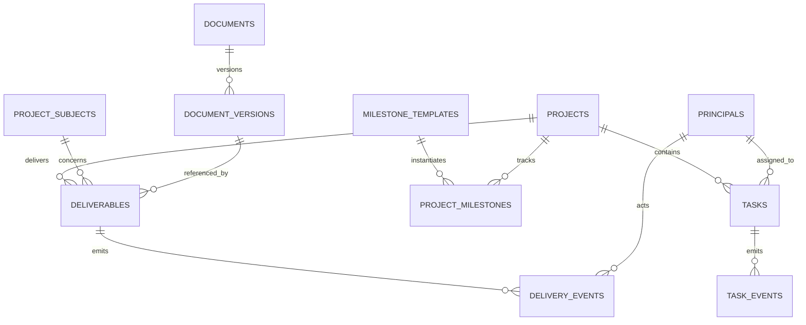

# M5 ERD

```mermaid
erDiagram
  PROJECTS ||--o{ TASKS : contains
  PRINCIPALS ||--o{ TASKS : assigned_to
  TASKS ||--o{ TASK_EVENTS : emits
  MILESTONE_TEMPLATES ||--o{ PROJECT_MILESTONES : instantiates
  PROJECTS ||--o{ PROJECT_MILESTONES : tracks
  PROJECTS ||--o{ DELIVERABLES : delivers
  PROJECT_SUBJECTS ||--o{ DELIVERABLES : concerns
  DOCUMENTS ||--o{ DOCUMENT_VERSIONS : versions
  DOCUMENT_VERSIONS ||--o{ DELIVERABLES : referenced_by
  DELIVERABLES ||--o{ DELIVERY_EVENTS : emits
  PRINCIPALS ||--o{ DELIVERY_EVENTS : acts
```
